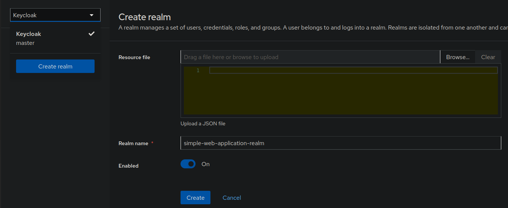
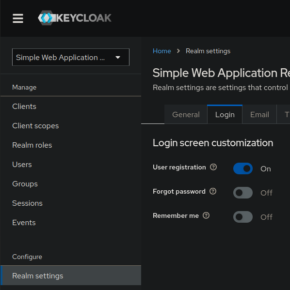
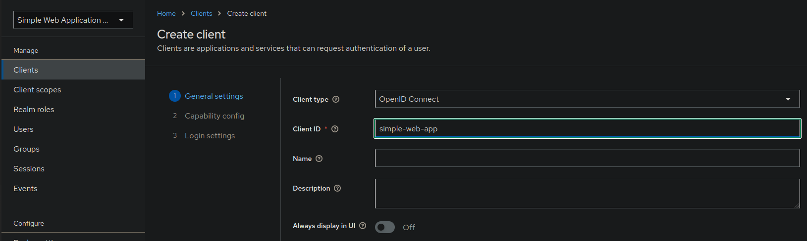
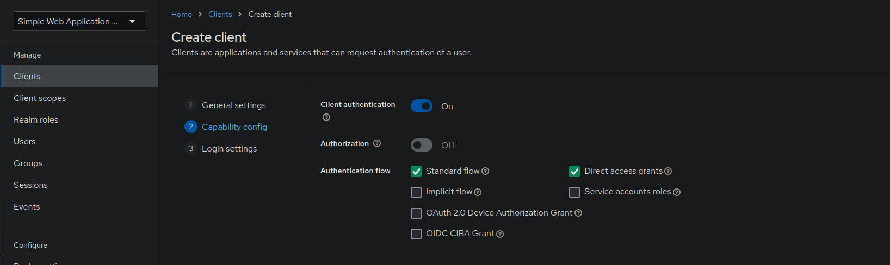
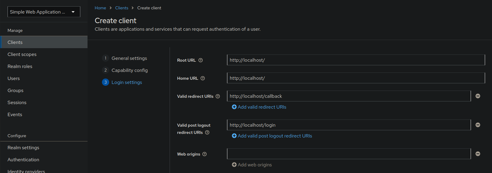
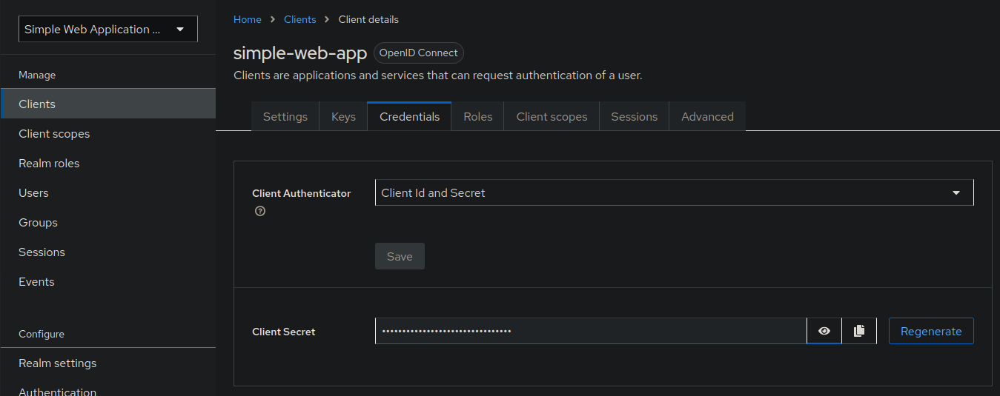
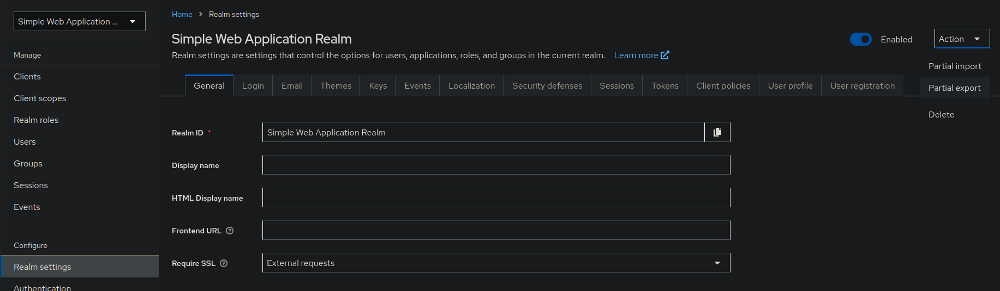
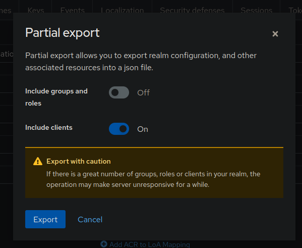

# How to Secure a Simple Web with Keycloak

Picture this: you’ve built the Mona Lisa of web apps. It’s sleek, responsive, and your mom already told all her friends about it. 
But there’s a problem—who’s sneaking in? The neighbor’s cat? Your ex? The bots plotting to sell your user data?

Enter Keycloak, the bouncer your web app deserves. 
Keycloak doesn’t just stand at the door checking IDs—it’s the ultimate gatekeeper, ready to keep out the riffraff while handing VIP badges to your legitimate users. 
With just a few configurations, it turns your app into a fortress, complete with identity management, single sign-on (SSO), and all the cool acronyms you can dream of.

In this guide, we'll show you how to integrate Keycloak into your app, step by step, without needing a master’s degree in security wizardry. 
Think of it as the IKEA of authentication setups—minimal tools, clear-ish instructions, and the occasional head-scratch. 
By the end, your app will have more swagger than a nightclub with a velvet rope. Let’s dive in!

## Step 1: Setup Simple Web App
Alright, it’s time to roll up our sleeves and get down to business. Before Keycloak can work its magic, we need a web app that’s ready to welcome it with open arms (and a solid codebase). Think of this as setting up the stage for Keycloak to come in and steal the show.  

### Gather Your Ingredients  

We’re keeping it simple here—a lightweight Flask app with just enough sauce to showcase Keycloak’s power. First, let’s get those dependencies in line:  

`requirements.txt`:  
```text
Flask==3.1.0
Authlib==1.3.2
python-keycloak==5.1.1
```
Why these? Flask is our go-to for quick and clean web apps, Jinja2 handles the templating, and Authlib plus python-keycloak will help us tango with Keycloak like pros.
### Hello, Flask!

Next, whip up a simple `app.py` to get the app running:
```python
from flask import Flask

app = Flask(__name__)

@app.get("/")
def display_index():
    return "Hello World!"
```
This is your web app equivalent of “Hello, it’s me.” Nothing fancy, but hey, every masterpiece starts with a blank canvas.

### Fire It Up
Now it’s time to see our baby take its first steps. Follow these commands:
```shell
python3 -m venv .venv
source .venv/bin/activate
python3 -m pip install -r requirements.txt
python3 -m flask run
```
If everything goes smoothly, you’ll see your app live at http://127.0.0.1:5000. 
Open it up in your browser, and there it is: a humble “Hello World!” waiting to grow into something much cooler.

## Step 2: Dockerize Your App

So, your app is running locally, and you’re feeling like a coding wizard. 
But let’s be honest—what’s the point if it can’t break free from your laptop and live its best life in the cloud (or at least on a server)? 
It’s time to put that app into a Docker container and make it portable, scalable, and just downright cool.

### Write a Dockerfile  

A `Dockerfile` is like a recipe for building a gourmet app container. Here’s what it looks like for our Flask app:

```dockerfile
FROM python:3.13-slim

WORKDIR /app

COPY requirements.txt .

RUN pip install --no-cache-dir -r requirements.txt

COPY app.py .

EXPOSE 5000

ENV FLASK_APP=app.py
ENV FLASK_RUN_HOST=0.0.0.0

CMD ["flask", "run"]
```

Let’s break it down:
 - **Base Image**: We’re using python:3.13-slim—lightweight, fast, and all the Python goodness.
 - **Working Directory**: /app is where all the magic will happen inside the container.
 - **Dependencies**: We copy requirements.txt and install everything with pip.
 - **Code**: The app.py gets dropped into the container like a star actor onto a stage.
 - **Expose the Port**: Flask defaults to port 5000, so we make it visible to the outside world.
 - **Run the App**: The final CMD starts the show.

### Add Docker Compose

Why stop at a container when you can orchestrate it like a symphony? 
Docker Compose is here to make life easier, especially if you add a database or other services down the line. 
Here’s a simple docker-compose.yml:

docker-compose.yml:
```yaml
version: '3.9'

services:
  app:
    build:
      context: ./
    ports:
      - "80:5000"
```

This does two key things:
 - **Builds the Image**: It points to your Dockerfile and takes care of building the app.
 - **Maps Ports**: It maps port 5000 inside the container to port 80 on your machine, so your app is accessible at http://localhost.

### Fire Up Your App in Docker

Once your Dockerfile and docker-compose.yml are in place, you’re just one command away from greatness:

```shell
docker compose up -d
```

This command builds your image, starts the container, and detaches it (hence the -d). 
To check that it's running, navigate to http://localhost in your browser, and voila! 
Your app is now running inside a Docker container. 
The “Hello World!” is still humble, but now it’s got a passport to travel anywhere Docker is allowed.

## Step 3: Secure Your Useless App with Keycloak

Congrats, you’ve built the perfect playground for Keycloak to show off its skills. 
In this section, we’ll bring in the bouncer, set up the ID checks, and make sure no shady characters sneak past the door. 
Buckle up—it’s about to get fun!

In this section, we'll do some Keycloak magic. 
We've already built our simple web app, but it's not secured yet.
This will happen in this section.

First, we will have a look on how to set up Keycloak with docker and how to configure a new realm and a new client, after 
which we will discuss how to tell our simple web app that it should actually use the Keycloak service we set up.
This will be done via a OIDC workflow.

### Starting Keycloak in Docker

Getting started with Keycloak in Docker is as simple as putting the following config in your `docker-compose.yml` and 
running `docker compose up -d`.

```yml
services:
  keycloak:
    image: quay.io/keycloak/keycloak:24.0
    container_name: keycloak
    environment:
      KC_HOSTNAME: localhost
      KC_HOSTNAME_PORT: 7080
      KEYCLOAK_ADMIN: admin
      KEYCLOAK_ADMIN_PASSWORD: Start123
      KC_HOSTNAME_STRICT_BACKCHANNEL: false
      KC_HEALTH_ENABLED: "true"
      KC_LOG_LEVEL: info
    healthcheck:
      test: [ "CMD", "curl", "-f", "http://keycloak:7080/health/ready" ]
      interval: 15s
      timeout: 2s
      retries: 15
    command: ["start-dev", "--http-port", "7080", "--https-port", "7443"]
    ports:
      - "7080:7080"
    networks:
      - <your-app-network>
```

We use the Docker image `quay.io/keycloak/keycloak:24.0` and our container will be named "keycloak".
Also, we need to configure some environment variables.
Those are all pretty straightforward.
It's very important that `KC_HOSTNAME_STRICT_BACKCHANNEL` is set to false, as otherwise Keycloak would refuse REST calls
coming from the backend of our webapp.
Healthcheck is optional, but can be very helpful, as Docker can show us not only if our container is up or down, but
also whether the service inside the container is running correctly (healthy).

Command tells Keycloak to start in development mode.
In our case, this is very important, as in not-development-mode, Keycloak would insist on using HTTPS for which we would
need a certificate and have all kinds of other trouble.
Therefore, we'll just use it in development mode and ignore all warnings that we shouldn't.
Don't use it in production though!

Furthermore, our keycloak container should be connected to the same network our simple web app is connected to.
We still need to open port 7080 to the public, as the Keycloak admin console is running there.

Now we type `docker compose up -d` and, voilá, have a running Keycloak instance.

### Configuring Keycloak

In this section, we'll configure Keycloak via the admin console, so that it can be used by our simple web app.
First, open `http://localhost:7080` and login with the username and password we configured in the `docker-compose.yml`.

Create a new realm and give it a name.
Make sure that this name has no url-incompatible characters (like whitespaces) as otherwise this will cause problems later on.


After clicking "Create", go to the realm settings of your new realm and enable "User registration" in the tab "Login".
If we enable this we can skip creating sample users, which would be a pain in the ass when exporting the realm later on.


Then, go to Clients and click "Create client".
Give it a client id.


Enable client authentication.


Enter the URLs of your application.
In our case, this is "http://localhost/".
We can omit the port here, as it is the default port 80. 
If we used some development port like 5000, we must explicitly set it here.


After clicking "Create", navigate to the "Credentials" tab of your newly created client, and copy the client secret for later.


Keycloak is now fully configured.

### Exporting Keycloak Configuration

Now that we configured our Keycloak service, imagine having to do this everytime you deploy your service.
Luckily, there's a way we don't have to do that.

First, we need to export our configuration to a json file.
For this, navigate to the realm settings of your realm and click "Partial export" in the dropdown in the top right corner.


Select "Include clients" and export.
As you can see, there's no option to export users.
This is the reason why we enabled user registration before, so we don't have to create a new test user each time we deploy Keycloak.
(It's possible to manually add users to the exported realm file, but you don't want to do that. Trust me.)


After exporting, open the `.json` file and search for ""secret": ".
Paste the secret we copied earlier here instead of the "**********".
Keycloak doesn't export client secrets for security reasons, but for our use case, we need it in the exported realm file.

Now we can configure our `docker-compose.yml` to automatically import the realm when starting up Keycloak.
We do this in the following way:

```yml
services:
  keycloak:
    image: quay.io/keycloak/keycloak:24.0
    container_name: keycloak
    environment:
      KC_HOSTNAME: localhost
      KC_HOSTNAME_STRICT_BACKCHANNEL: false
      KC_HOSTNAME_PORT: 7080
      KEYCLOAK_ADMIN: admin
      KEYCLOAK_ADMIN_PASSWORD: Start123
      KC_HEALTH_ENABLED: "true"
      KC_LOG_LEVEL: info
    healthcheck:
      test: [ "CMD", "curl", "-f", "http://keycloak:7080/health/ready" ]
      interval: 15s
      timeout: 2s
      retries: 15
    command: ["start-dev", "--http-port", "7080", "--https-port", "7443", "--import-realm"]
    ports:
      - "7080:7080"
    networks:
      - reddyt
    volumes:
      - ${PWD}/keycloak:/opt/keycloak/data/import
```

As you can see, we added a `--import-realm` flag to the command option.
This will instruct Keycloak to import any realm files from `/opt/keycloak/data/import` inside the container when starting up for the first time.
We ensured that the exported realm file is in place by adding a volume from our local `keycloak` folder to the location in the container.
All you have to do is place your exported realm file into the `keycloak` folder.

### Configure the Simple Web App

We did set up our Keycloak service, however, if we visit `http://localhost/` in our browser, we can still enter our
simple web app without any login prompts.
That is, because the app doesn't know anything about Keycloak yet.
We'll change that in this section.

#### Packages

First, we need to install the necessary python packages.
You'll need:

- Authlib (we're using version 1.3.2)
- python-keycloak (we're using version 5.1.1)

Include these in your `requirements.txt`, run a quick `pip install -r requirements.txt` and you're good to go.

#### Register OAuth Client

Now we need to configure our app.
For this, we need to add the following code to our `app.py`:

```python
from authlib.integrations.flask_client import OAuth
from flask import Flask

app = Flask(__name__)

app.secret_key = "<some-very-secret-string>" # Don't do this in production
oauth = OAuth(app)
keycloak = oauth.register(
    name="keycloak",
    client_id="simple-web-app", # Please use environment variables for these in production
    client_secret="lmG9Tx16hrulnvD2YfYsNxNbGd6WSfwC",
    server_metadata_url="http://keycloak:7080/realms/simple-web-application-realm/.well-known/openid-configuration",
    client_kwargs={"scope": "openid profile email"},
)
```

What does it do?
We gave our flask app a secret key, so it can handle session management for us.
Also, we configured an oauth client for our flask app.
On this oauth client, we register our Keycloak service with the client id and secret we set before and a server metadata 
url (or .well-known endpoint), which we can find in Keycloak in the realm settings on the bottom of the page.
The scopes we set in the client_kwargs are defined by the OIDC standard.

In production, please use some environment variables for all the config parameters and especially for the secrets, but NEVER hardcode them in the sourcecode.
We did it here as we felt that an environment service would just complicate things and distract from Keycloak.

#### Configure Routes

Now our app knows about the Keycloak service, but still doesn't use it for authentication.
Therefore, we need to configure some routes:

```python
import secrets

from authlib.oauth2 import OAuth2Error
from flask import session, url_for, redirect

@app.route("/login")
def login():
    nonce = secrets.token_urlsafe(16)
    session['nonce'] = nonce
    redirect_uri = url_for('callback', _external=True)
    return keycloak.authorize_redirect(redirect_uri, nonce=nonce)

@app.route("/callback")
def callback():
    try:
        token = keycloak.authorize_access_token()
        session['token'] = token
        user_info = keycloak.parse_id_token(token, session.pop("nonce", None))
        session['user'] = user_info
        return redirect("/")
    except OAuth2Error as error:
        return f"Authentication failed: {error.description}"
```

We configured a `/login` route that redirect the user to the Keycloak login screen when entered, and a `/callback` route
that Keycloak can redirect the user to when the login is done.
After authentication, we save the user info to their session as we might need it somewhere.

Now users can authenticate themselves.
However, try visiting `http://localhost/` without being authenticated.
You should be able to visit the app without authenticating.
This should be different.
The app should automatically redirect any unauthenticated user to the login page.
To accomplish that, we add the following check to our `app.py`:

```python
from flask import request, session, url_for, redirect

@app.before_request
def check_authentication():
    if request.endpoint in ["login", "callback"]:
        return
    if "user" not in session:
        return redirect(url_for("login"))
```

Now we check whether the session has some user info for each call we receive.
We exclude the `/login` and `/callback` routes, as these should be reachable for unauthenticated users.
For all other routes, we redirect unauthenticated users to the login page.

#### Logout

Now all users need to log in in order to use our app.
However, they are not able to log out again.
We'll change that in this section.

We already configured a valid post logout url in Keycloak (which is the only thing that does not come out of the box).
So all we have to do is to tell our app how to logout.
We add a logout button and a `/logout` route to our `app.py`:

```python
from flask import session, url_for, redirect

@app.get("/")
def display_index():
    return """
    <p>Hello World!</p>
    <p><a href="/logout">Logout</a></p>
    """

@app.route('/logout')
def logout():
    id_token = session['token']['id_token']
    if not id_token:
        return redirect(url_for('login'))
    keycloak_logout_url = "http://localhost:7080/realms/simple-web-application-realm/protocol/openid-connect/logout"
    post_logout_redirect_uri = url_for('login', _external=True)
    session.clear()
    return redirect(
        f"{keycloak_logout_url}?id_token_hint={id_token}&post_logout_redirect_uri={post_logout_redirect_uri}")
```

The logout button redirects to the `/logout` endpoint.
This logout endpoint checks whether the user has an id token, revokes the token on Keycloak if present, and redirects the
user to the login page.
Token revocation is done by redirecting the user to the Keycloak token revocation endpoint with the token and a post
logout redirect uri, which in turn is used by Keycloak to redirect the user to after the token has been revoked.
Also, we clear the flask session.

---

With that in place you have successfully set up your simple web application with keycloak.

Cheers!
